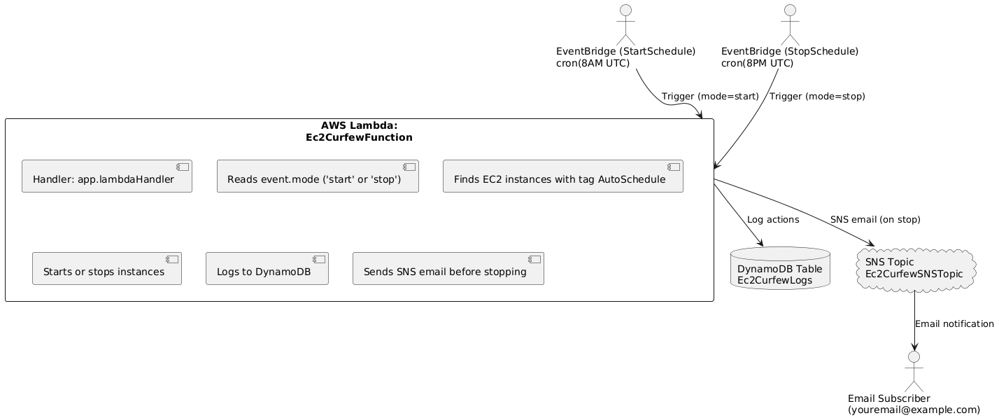

# ec2-curfew

**Save costs by powering EC2 instances on/off based on tags and scheduled rules.**

---

## Architecture



**Flow:**
- **EventBridge** triggers the Lambda function on a schedule with a mode (`start` or `stop`).
- **Lambda** finds EC2 instances with the tag `AutoSchedule=on` and starts or stops them.
- All actions are logged to **DynamoDB**.
- Before stopping, Lambda sends an email notification via **SNS**.
- **SNS Topic** notifies the configured email address.

---

## Resources

- **Lambda Function**: Main logic to start/stop EC2 and log actions.
- **DynamoDB Table**: Stores logs of all actions.
- **SNS Topic & Email Subscription**: Sends notification emails before stopping instances.
- **EventBridge Scheduled Rules**: Triggers Lambda at specified times.

---

## Deployment

1. **Clone this repo** and install [AWS SAM CLI](https://docs.aws.amazon.com/serverless-application-model/latest/developerguide/install-sam-cli.html).
2. **Update the SNS email** in `template.yaml` under `Ec2CurfewSNSEmailSubscription`.
3. **Deploy:**
   ```sh
   sam build
   sam deploy --guided
   ```
4. **Confirm SNS subscription** in your email inbox.

---

## Usage

- Tag EC2 instances you want managed with:  
  `AutoSchedule=on`
- Lambda will start/stop these instances based on the EventBridge schedule (default: 8AM start, 8PM stop UTC).
- Check DynamoDB for logs and your email for stop notifications.

---

## Customization

- **Change schedule:** Edit the `Schedule` expressions in `template.yaml`.
- **Change tag:** Edit `INSTANCE_TAG_KEY` and `INSTANCE_TAG_VALUE` in `src/app.mjs`.
- **Change email:** Update the SNS subscription in `template.yaml`.

---

## License

MIT